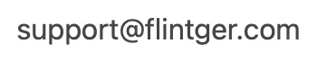

<!--

 
  

-->

  
  

# OmniLock

**OmniLock** - Screen time management: Hide Apps, Block Apps, Reduce screen time, Block Ads, Trackers, Phishing, Adult Content etc.

- [URL Schemes](url-schemes.md)

## Install

## Features

### App Restrictions

#### App installation/deletion prevention

Hide app store to prevent installing any new apps. You can also prevent app deletion to avoid lost data by accidentally deleting an app.

#### Hide Apps

Hide Apps allows you to specific apps hide from Home screen, app library and Settings app list. Hide apps aim to better protect your privacy.

Facts about Hide Apps:

- Hide from Home screen.
- Hide from App library.
- Hide from App search.
- Hide from Settings app list.
- Some system apps like Phone, Settings can not be hidden. Also you can not hide A1Blocker itself.
- Hidden app do not show notification in hidden state.
- If you launch app before hide it.
  Hidden app may still running after hidden state, but you won't see it UI until you un-hide it.

#### Shield Apps and Websites

Shield Apps and Websites allows you to restrict access to apps and websites by covering with a shield view.

### Network Shield

#### Web Filter

- Block specific domains on Safari, Chrome, Firefox and all other browsers.

#### Safari Content Blocker

- Block adult content on Safari.
- Block website by your custom keyword.
- Security Enhancement: Block phishing, malware, spyware and crypto coin mining websites.
- Block ad and trackers to protect your privacy.

To turn on/off Safari content blocker, please go to system Settings -> Safari -> Extensions.

Content blockers have no knowledge of users' history or the websites they visit.

#### Safari Browser Settings

- Prevent auto fill form, disallow use saved passwords, addresses, credit cards etc.
- Cookie policy allows you to limit cookie to 3rd party sites.

### Passcode Lock

Use passcode to lock your **OmniLock**.

## About

**OmniLock** is not an open source project, this repo is used to get feedback.

## Contact

